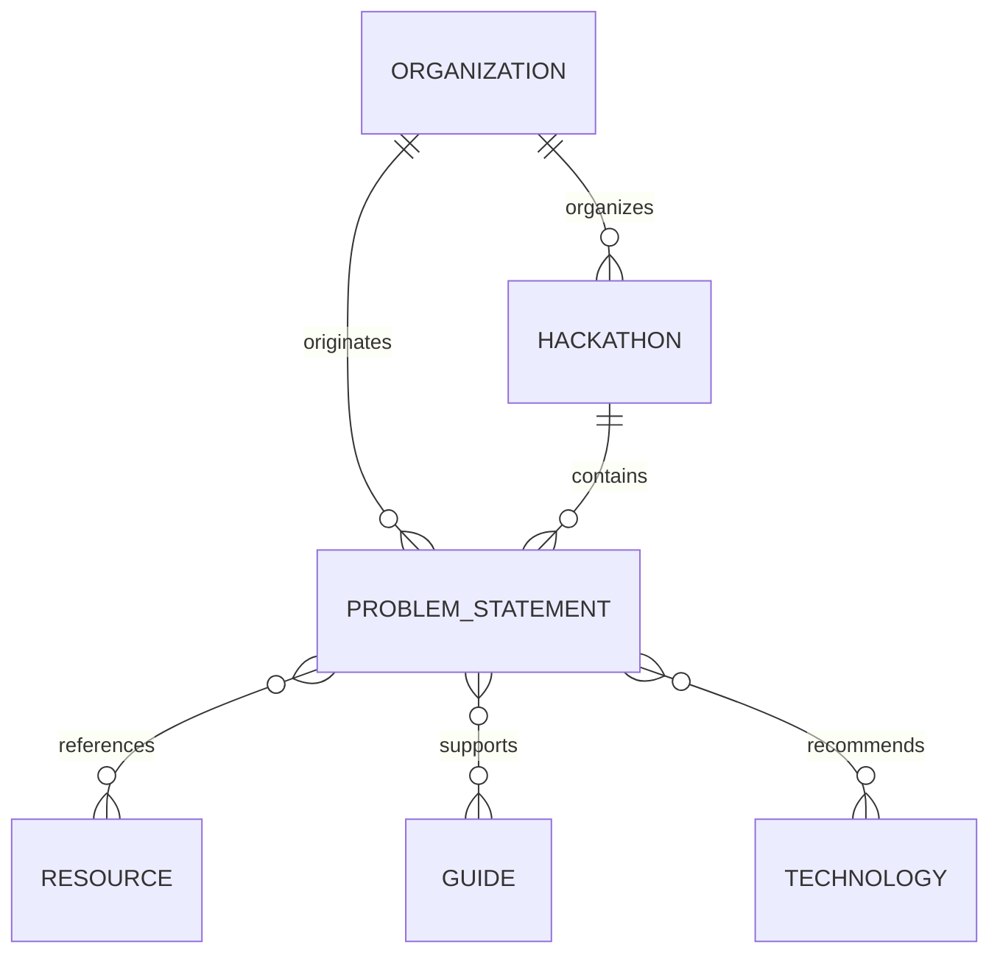

# HackIndia - Data Model

## 1. Data Model Principles

HackIndia's data model defines canonical records for a knowledge and discovery platform covering hackathons, problems, resources, research, guides, technologies, and future community content. The model is conceptual and is intended to guide the MVP without requiring a database or application implementation yet.

- **Canonical records:** Each hackathon, problem, organization, resource, and guide should have one canonical record. Other content should reference that record rather than copying it.
- **Stable IDs:** Every record should have an internal ID that remains stable even if a display title or URL slug changes.
- **Human-readable slugs:** Public records should use readable, stable slugs that are useful in URLs and search results.
- **Source and provenance:** Externally sourced facts, HackIndia research, recommendations, original content, and future community contributions must remain distinguishable.
- **Content separated from presentation:** Records contain structured content and relationships; routes and reusable UI components decide how to render them.
- **Extensibility:** Models should allow new fields, relationships, categories, and source types without breaking existing records.
- **SEO-friendly URLs:** Public records need stable canonical URLs that do not depend on changing titles or database implementation details.
- **No duplicated information:** Relationships should point to canonical entities. For example, a problem should reference its organization and originating hackathon instead of duplicating their full records.

The model should support the full ecosystem while remaining simple enough for local structured content in the MVP.

## 2. Entity Overview

| Entity | Purpose |
| --- | --- |
| `Hackathon` | An external or HackIndia event that may contain many problem statements. |
| `ProblemStatement` | A problem-intelligence record associated with an external event, HackIndia, or the future community. |
| `Organization` | A reusable organizer or source organization referenced by hackathons and problems. |
| `Resource` | A reusable dataset, API, paper, tool, tutorial, government resource, or technical reference. |
| `Guide` | A research, technology, hackathon, strategy, or project-building page that can serve multiple problems. |
| `Category` | A controlled broad classification such as Healthcare or Education. |
| `Technology` | A specific tool, framework, platform, language, standard, or technical approach. |
| `Source` | Provenance for an official, research, or other external claim or record. |
| `Tag` | A flexible searchable label used across entities without replacing formal categories. |

These entities are enough to establish the core content graph. User accounts, submissions, moderation, analytics, recommendations, and AI-specific entities are future concerns and are not required for the MVP model.

## 3. Hackathon Entity

A `Hackathon` represents an event or competition from a government organization, national competition, company, college or institute, online organizer, or HackIndia itself.

### Conceptual fields

| Field | Required | Purpose |
| --- | --- | --- |
| `id` | Yes | Stable internal identity for relationships and storage migration. |
| `slug` | Yes | Unique, readable URL identity, such as `smart-india-hackathon-2026`. |
| `name` | Yes | Official or approved event name shown to users. |
| `organizer` | Yes | Reference to an `Organization`, including its type and source. |
| `description` | Yes | Verified summary of the event. |
| `type` | Yes | Event classification such as national, college, government, corporate, or HackIndia. |
| `mode` | Yes | Online, in-person, or hybrid participation mode. |
| `location` | Optional | Physical location or geographic scope when applicable. |
| `startDate` | Optional | Event start date, when verified. |
| `endDate` | Optional | Event end date, when verified. |
| `registrationDeadline` | Optional | Final registration date and time, when published by an authoritative source. |
| `registrationUrl` | Optional | Link where participants register. |
| `officialUrl` | Yes for external events | Canonical official event page; optional only for an original record that has no external source. |
| `status` | Yes | Discovery state such as upcoming, ongoing, closing-soon, ended, or cancelled. |
| `eligibility` | Optional | Participation requirements and restrictions. |
| `prizeInformation` | Optional | Verified prize or recognition information. |
| `source` | Yes | `Source` record or provenance information for externally sourced event details. |
| `createdAt` | Yes | Record creation timestamp. |
| `updatedAt` | Yes | Last material record update timestamp. |

A field is required when a record cannot be meaningfully identified or safely published without it. Optional fields remain absent or explicitly pending when information is unavailable; they should not be filled with invented values. `organizer` should reference a reusable organization so the same ministry, company, college, university, or HackIndia record is not duplicated.

The model supports event discovery categories and statuses separately. For example, a government online event can have `type: "government"` and `mode: "online"`, while its discovery status may be `registration-open`. `ongoing`, `upcoming`, `closing-soon`, and `ended` should normally be derived from dates and registration data rather than unnecessarily duplicated as permanent facts. `cancelled` may be an explicit editorial status because it cannot be inferred reliably from dates alone.

## 4. Problem Statement Entity

A `ProblemStatement` is the canonical content type for problem intelligence. It supports external problem identifiers such as `SIH26001`, HackIndia Original Problems such as `HACKINDIA001`, and future community-created problems.

### Conceptual fields

| Field | Required | Purpose |
| --- | --- | --- |
| `id` | Yes | Stable internal HackIndia ID. |
| `externalId` | Optional | Identifier assigned by an external organizer, such as `SIH26001`. |
| `slug` | Yes | Stable public URL identity, such as `sih26001`. |
| `title` | Yes | Display title for the problem. |
| `shortDescription` | Yes | Concise summary for listings and metadata. |
| `fullDescription` | Yes for published content | Official statement or approved full problem content, with provenance. |
| `organization` | Yes | Reference to the originating or responsible `Organization`. |
| `hackathon` | Optional | Reference to the primary originating `Hackathon`; absent for an independent problem. |
| `sourceType` | Yes | `official`, `hackindia-original`, or `community`. |
| `source` | Yes | Provenance record or records for the problem. |
| `domain` | Yes | Subject area such as Healthcare, Agriculture, or Mobility. |
| `category` | Yes | Controlled broad classification. |
| `technologies` | Optional | References to relevant `Technology` records. |
| `difficulty` | Optional | Editorial difficulty classification when a consistent rubric exists. |
| `expectedOutcome` | Optional | Expected result or goal, separated from recommendations. |
| `constraints` | Optional | Official or verified constraints, clearly sourced. |
| `eligibility` | Optional | Who may work on or submit the problem, when applicable. |
| `status` | Yes | `draft`, `published`, `archived`, or `community-submitted`. |
| `createdAt` | Yes | Record creation timestamp. |
| `updatedAt` | Yes | Last material record update timestamp. |

The full content associated with a problem may additionally contain structured sections for summary, explanation, why it matters, target users, research, existing solutions, analysis, solution directions, recommended technologies, datasets, APIs, resources, references, and FAQs. These sections should preserve their authorship and source classification.

### Three identities

The internal HackIndia ID, external identifier, and public URL slug serve different purposes:

- **Internal HackIndia ID:** The stable identity assigned by HackIndia, such as an opaque internal value. It should remain stable across storage migrations and title changes.
- **External organizer/problem ID:** The identifier assigned by the source organization, such as `SIH26001` or another official code. It may be absent for HackIndia Original or community problems.
- **URL slug:** The readable routing identity, such as `sih26001`, derived from a stable identifier or approved title. It should remain stable after publication.

A problem can therefore be represented by an internal ID while retaining an external ID and a clean public URL:

```text
internal id:   [HackIndia internal ID]
external id:   SIH26001
slug:          sih26001
canonical URL: /problems/sih26001
```

The problem remains associated with its parent hackathon through the `hackathon` relationship and with its provenance through `source`. Adding HackIndia research, resources, tags, or recommendations enriches the record without changing the official problem statement.

## 5. Problem Provenance

Every problem must identify where it originated and who authored each layer of content.

### Official problems

`sourceType: "official"` means the problem was officially published by an external organization or hackathon. Its external identifier, official statement, organizer, event, constraints, and eligibility must be attributed to authoritative sources. HackIndia may explain, research, and analyze it, but must not rewrite those additions as official content.

### HackIndia Original Problems

`sourceType: "hackindia-original"` means HackIndia created the problem or challenge. The record should identify HackIndia as the creator and must not imply that the problem was published by a government ministry, company, college, or other external organizer. A record such as `HACKINDIA001` should be labeled **HackIndia Original Challenge**.

### Community-submitted problems

`sourceType: "community"` means the future HackIndia community submitted the problem or challenge content. It should be attributed to the contributor, reviewed before publication, and kept distinct from official and HackIndia editorial content.

Provenance should be retained at both record and section level where needed:

```text
Official Information
        |
HackIndia Research
        |
HackIndia Analysis
        |
HackIndia Recommendations
        |
Community Contributions
```

HackIndia-generated or AI-generated material must never appear to be officially published by another organization.

## 6. Hackathon and Problem Relationship

One hackathon can contain many problem statements. A problem normally belongs to one originating hackathon, but it may exist independently, such as a HackIndia Original Challenge. A problem can retain an external identifier even when HackIndia enriches it with additional content.



Examples:

```text
Smart India Hackathon
    |-- SIH26001
    |-- SIH26002
    `-- SIH26003

HackIndia Original Problems
    |-- HACKINDIA001
    `-- HACKINDIA002
```

A problem can have zero or one primary `hackathon` relationship. Related hackathons may be represented separately if a problem is reused or discussed in another event, but the originating relationship should remain unambiguous. Relationships should reference canonical IDs or slugs and should not create duplicate copies of the same problem.

## 7. Resource Entity

A `Resource` is a reusable item that helps builders research or implement solutions. Supported resource types include datasets, APIs, research papers, documentation, tools, tutorials, government resources, and technical references.

### Conceptual fields

- `id`: Stable internal ID.
- `slug`: Readable public resource URL identity.
- `title`: Resource name.
- `description`: Accurate explanation of its use.
- `resourceType`: Dataset, API, research paper, documentation, tool, tutorial, government resource, or technical reference.
- `url`: Canonical resource URL.
- `source`: Provider, author, and provenance record.
- `technology`: Related `Technology` references.
- `tags`: Searchable labels.
- `license`: License or usage terms, when applicable.
- `relatedProblems`: Problem references.
- `relatedHackathons`: Hackathon references.
- `relatedGuides`: Guide references.
- `createdAt`: Creation timestamp.
- `updatedAt`: Last material update timestamp.
- `status`: Draft, published, or archived state.

A single resource should be reusable across multiple problems and guides. A resource should not be copied into each problem record; relationships should point to its canonical record. Access requirements, license limitations, and link validity should be retained where relevant.

## 8. Guide / Research Entity

A `Guide` represents research and reusable practical knowledge that is not limited to one problem. It supports technology guides, hackathon guides, winning strategies, project-building guides, research summaries, and technical explainers.

A conceptual guide record may contain:

- `id`
- `slug`
- `title`
- `guideType`
- `summary`
- `content`
- `source`
- `technologies`
- `problems`
- `hackathons`
- `resources`
- `references`
- `tags`
- `status`
- `createdAt`
- `updatedAt`

Relationships to technologies, problems, hackathons, and resources allow one guide to serve many students and contexts. A guide should clearly distinguish verified research from HackIndia recommendations and should not duplicate the full content of a related problem or resource.

## 9. Organization Entity

An `Organization` is a reusable representation of an organizer, publisher, provider, or source organization. It prevents the same organization from being duplicated across hackathons, problems, and resources.

A conceptual organization record may contain:

- `id`
- `slug`
- `name`
- `organizationType`
- `description`
- `officialUrl`
- `logoOrImage`
- `location`
- `source`
- `createdAt`
- `updatedAt`

`organizationType` should support government organizations, ministries, companies, colleges, universities, HackIndia, and other organizers. The same organization record can be referenced as a hackathon organizer, a problem originator, or a resource provider. Official naming should be preserved and aliases can be added without creating duplicate organizations.

## 10. Category, Technology, and Tag Model

These classification concepts have different jobs and should not become overlapping systems.

- **Category:** A controlled, broad classification used for primary browsing and aggregation. Example: `Healthcare`.
- **Technology:** A specific technical tool, framework, platform, language, standard, or approach used to build a solution. Example: `React`.
- **Tag:** A flexible searchable label that adds context across content types. Examples: `AI`, `IoT`, and `Women Safety`.

A problem can have one primary category, several technologies, and multiple tags. For example:

```text
Category:   Healthcare
Technology: React
Tags:       AI, IoT, Women Safety
```

Categories should remain relatively stable and curated. Technologies should be reusable entities so guides, resources, and problems can share them. Tags can support discovery and evolve more freely, but should not be used to create an uncontrolled duplicate category system.

## 11. Source Model

A `Source` preserves provenance for every externally sourced record or claim. It may be associated with a complete record, a content section, or a specific factual statement.

A source should be able to identify:

- `id`: Stable source record ID.
- `sourceOrganization`: Organization that published or maintains the source.
- `sourceUrl`: URL to the original material.
- `sourceType`: Official source, research paper, dataset provider, API provider, government source, technical documentation, or other classification.
- `originalIdentifier`: Original event, problem, publication, or resource identifier when available.
- `verificationStatus`: Unverified, pending review, verified, or needs review.
- `lastVerifiedDate`: Date the source was last checked.
- `title`: Source title where useful.
- `accessedAt`: Date the material was accessed, where useful.

Official source information should not be overwritten by HackIndia editorial enrichment. A source record can be updated when the authoritative page changes, while the relationship and provenance history remain visible.

## 12. Status Model

Statuses describe editorial or discovery state and should not be confused with categories.

### Hackathon statuses

- `upcoming`
- `ongoing`
- `closing-soon`
- `ended`
- `cancelled`

`upcoming`, `ongoing`, `closing-soon`, and `ended` should be derived from dates, registration deadlines, and verified event information where appropriate. `cancelled` should be an explicit status because it cannot reliably be inferred from dates. The MVP does not need to implement status calculation yet.

### Problem statuses

- `draft`
- `published`
- `archived`
- `community-submitted`

A community submission may remain `community-submitted` during review and should not be treated as published canonical content until it passes the editorial process. Status fields are editorial controls; `sourceType` still identifies the origin of the problem.

## 13. URL and SEO Identity

Canonical public URLs should use stable, human-readable slugs:

```text
/hackathons
/hackathons/smart-india-hackathon-2026
/problems
/problems/sih26001
/resources
/resources/datasets
/guides
/guides/react-for-hackathons
```

Stable slugs and IDs should not depend on changing display titles. A title can be corrected or improved while the internal ID, external identifier, and canonical slug remain stable. If a published slug must change, the old URL should later redirect to the canonical URL rather than creating duplicate content.

Individual problem pages such as `/problems/sih26001` should be independently indexable. Metadata, semantic HTML, canonical links, structured data where appropriate, sitemap inclusion, and internal links should be generated from the canonical record. This makes pages discoverable through direct searches, related content, and internal discovery without promising any particular search-engine ranking.

## 14. Example Records

The following are conceptual JSON examples only. They are not production seed data, and values should be verified before publication.

### 1. Smart India Hackathon

```json
{
  "id": "[hackathon-internal-id]",
  "slug": "smart-india-hackathon-2026",
  "name": "Smart India Hackathon 2026",
  "organizer": "[organization-id]",
  "description": "[Verified event description]",
  "type": "national",
  "mode": "[online|in-person|hybrid]",
  "location": "[Verified location or null]",
  "startDate": "[YYYY-MM-DD]",
  "endDate": "[YYYY-MM-DD]",
  "registrationDeadline": "[YYYY-MM-DDTHH:mm:ssZ]",
  "registrationUrl": "[Verified registration URL]",
  "officialUrl": "[Verified official URL]",
  "status": "upcoming",
  "eligibility": "[Verified eligibility]",
  "prizeInformation": "[Verified prize information]",
  "source": "[source-record-id]",
  "createdAt": "[ISO-8601 timestamp]",
  "updatedAt": "[ISO-8601 timestamp]"
}
```

### 2. SIH26001

```json
{
  "id": "[problem-internal-id]",
  "externalId": "SIH26001",
  "slug": "sih26001",
  "title": "[Verified problem title]",
  "shortDescription": "[Neutral verified summary]",
  "fullDescription": "[Official problem statement or approved excerpt]",
  "organization": "[organization-id]",
  "hackathon": "[hackathon-internal-id]",
  "sourceType": "official",
  "source": "[source-record-id]",
  "domain": "[Domain]",
  "category": "[Category]",
  "technologies": [],
  "difficulty": null,
  "expectedOutcome": "[Verified outcome or null]",
  "constraints": "[Verified constraints or null]",
  "eligibility": "[Verified eligibility or null]",
  "status": "draft",
  "createdAt": "[ISO-8601 timestamp]",
  "updatedAt": "[ISO-8601 timestamp]"
}
```

SIH26001 is a placeholder reference here. No factual information is implied.

### 3. HackIndia Original Problem HACKINDIA001

```json
{
  "id": "[problem-internal-id]",
  "externalId": "HACKINDIA001",
  "slug": "hackindia-001",
  "title": "[HackIndia Original Challenge title]",
  "shortDescription": "[HackIndia-authored summary]",
  "fullDescription": "[HackIndia-authored problem description]",
  "organization": "[hackindia-organization-id]",
  "hackathon": null,
  "sourceType": "hackindia-original",
  "source": "[HackIndia source record]",
  "domain": "[Domain]",
  "category": "[Category]",
  "technologies": [],
  "difficulty": "[Difficulty or null]",
  "expectedOutcome": "[HackIndia-defined outcome]",
  "constraints": "[Challenge constraints]",
  "eligibility": "[Eligibility or null]",
  "status": "draft",
  "createdAt": "[ISO-8601 timestamp]",
  "updatedAt": "[ISO-8601 timestamp]"
}
```

This record must be displayed as a HackIndia Original Challenge, not as an official external or government problem.

### 4. Generic Indian college hackathon

```json
{
  "id": "[hackathon-internal-id]",
  "slug": "[college-hackathon-slug]",
  "name": "[College Hackathon Name]",
  "organizer": "[college-organization-id]",
  "description": "[Verified event description]",
  "type": "college",
  "mode": "hybrid",
  "location": "[Verified Indian city or campus]",
  "startDate": "[YYYY-MM-DD]",
  "endDate": "[YYYY-MM-DD]",
  "registrationDeadline": "[YYYY-MM-DDTHH:mm:ssZ]",
  "registrationUrl": "[Verified registration URL]",
  "officialUrl": "[Verified official URL]",
  "status": "upcoming",
  "eligibility": "[Verified eligibility]",
  "prizeInformation": "[Verified prize information]",
  "source": "[source-record-id]",
  "createdAt": "[ISO-8601 timestamp]",
  "updatedAt": "[ISO-8601 timestamp]"
}
```

### 5. Dataset resource

```json
{
  "id": "[resource-internal-id]",
  "slug": "[dataset-slug]",
  "title": "[Dataset title]",
  "description": "[Accurate dataset description]",
  "resourceType": "dataset",
  "url": "[Verified dataset URL]",
  "source": "[dataset-source-record-id]",
  "technology": [],
  "tags": ["[tag]"],
  "license": "[Verified license or null]",
  "createdAt": "[ISO-8601 timestamp]",
  "updatedAt": "[ISO-8601 timestamp]"
}
```

### 6. Technology guide

```json
{
  "id": "[guide-internal-id]",
  "slug": "react-for-hackathons",
  "title": "React for Hackathons",
  "guideType": "technology",
  "summary": "[Guide summary]",
  "content": "[Structured guide content]",
  "source": "[source-record-id or HackIndia editorial record]",
  "technologies": ["[react-technology-id]"],
  "problems": [],
  "hackathons": [],
  "resources": ["[resource-id]"],
  "references": ["[reference-id]"],
  "tags": ["frontend", "prototyping"],
  "status": "draft",
  "createdAt": "[ISO-8601 timestamp]",
  "updatedAt": "[ISO-8601 timestamp]"
}
```

## 15. Relationships Summary

The core relationship map is:

```text
Organization
      |
      v
Hackathon
      |
      v
ProblemStatement
      |
      +---- Resources
      +---- Guides
      `---- Technologies
```

Resources and guides are reusable across multiple problems. Organizations are reusable across hackathons and problems. Sources can support any externally sourced record or individual content section. Categories, technologies, and tags provide shared discovery vocabulary without duplicating content.

## 16. MVP vs Future Data Model

### MVP model

The MVP should remain simple enough to implement quickly. It requires:

- Local structured records for published or draft hackathons, problems, resources, and guides.
- Stable internal IDs and readable slugs.
- Reusable organization references.
- Problem-to-hackathon relationships.
- Source and provenance fields.
- Basic categories, technologies, tags, and publication statuses.
- Canonical metadata inputs for SEO-friendly individual pages.
- Enough relationships to connect resources and guides to problems.

### Future model

The model can later expand to support:

- Community submissions and contributions.
- Search indexes and advanced filtering.
- Recommendations and personalized discovery.
- AI-assisted discovery, explanation, and research assistance.
- Analytics.
- User accounts.
- Submission and moderation workflows.
- Future HackIndia hackathons and challenges.

These future capabilities should extend the same canonical records and relationships rather than create competing sources of truth. No database, CMS, AI service, authentication, analytics system, or community functionality is implemented by this document.

## 17. Data Integrity Rules

- Internal IDs must be unique and stable.
- External IDs must be stored separately from internal HackIndia IDs.
- Slugs must be unique within their entity type and preferably globally unique for problems.
- Slugs should remain stable after publication and should not depend on changing titles.
- Official source information must not be overwritten by HackIndia editorial enrichment.
- Official statements, HackIndia research, analysis, recommendations, and community contributions must remain visibly distinguishable.
- Deleted or archived records should preserve their provenance, identifiers, and historical relationships where legally and operationally appropriate.
- Relationships should reference canonical records and must not create duplicate canonical entities.
- A problem should have no more than one primary originating hackathon relationship.
- Draft, unverified, and community-submitted content must not be presented as published fact.
- Dates, eligibility, deadlines, links, and status should be updated from authoritative sources.
- Resource licenses and access conditions must not be invented or omitted when they materially affect use.
- A missing value should remain absent or explicitly pending verification rather than being filled with fabricated information.

## 18. Future Database Mapping

This conceptual model can later map to a relational database with tables such as `organizations`, `hackathons`, `problem_statements`, `resources`, `guides`, `categories`, `technologies`, `sources`, and `tags`. Join tables can represent many-to-many relationships such as problems to resources, guides to technologies, and resources to tags. A foreign key can connect a problem to its organization and optional primary hackathon.

The same concepts can also map to another suitable persistence layer, provided it preserves stable IDs, slugs, source provenance, publication states, and canonical relationships. The content access layer should hide storage details from routes and UI components, so moving from local structured content to a database or CMS does not require redesigning the frontend.

A later migration should preserve existing canonical URLs and map old local IDs to persistent database IDs. It should also retain source verification history, archived records, and redirects for any approved slug changes.

No database is implemented or required at this stage.
