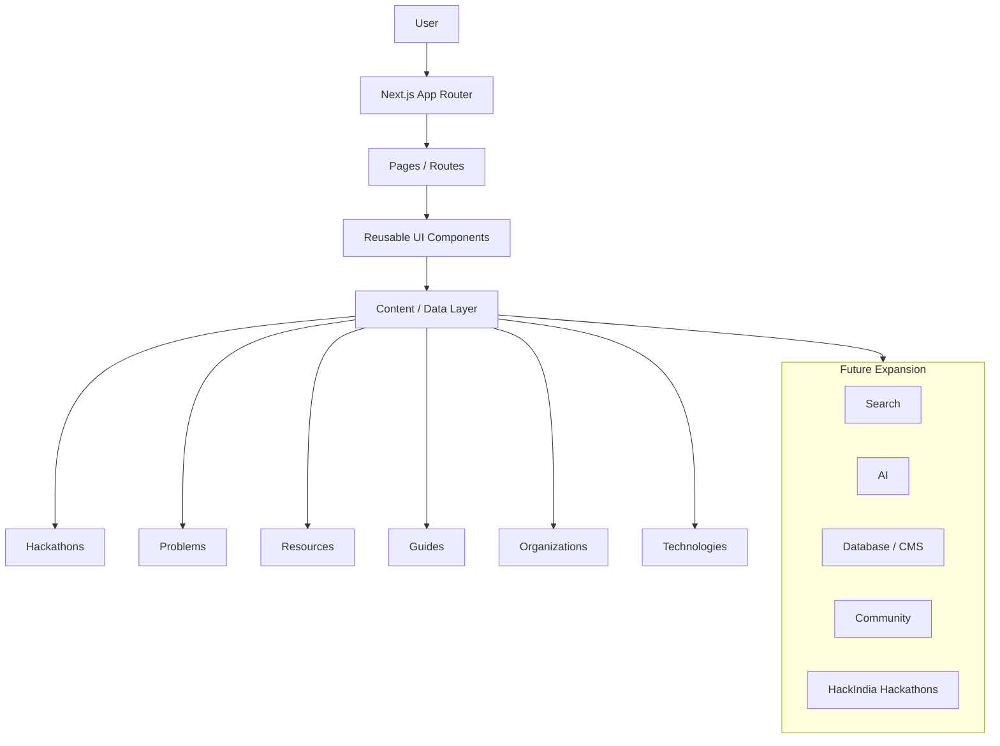

# HackIndia - MVP Implementation Plan

## 1. MVP Objective

The MVP of HackIndia must prove the platform’s core value proposition: help students discover hackathons, explore relevant problems, understand those problems, find useful resources, read practical guides, and start building.

### What the first usable product must accomplish

The first usable HackIndia product should allow a student to:

- discover relevant hackathons and competitions
- browse problem statements in a structured way
- understand a problem beyond its raw official text
- find curated resources such as datasets, APIs, papers, tools, and tutorials
- read practical guides that support research and project-building
- navigate from a hackathon to a problem to resources and guidance

### Who it is for

The MVP is built for:

- students and early-stage builders participating in hackathons
- learners exploring hackathon problem statements
- researchers who need organized, clearly sourced background material
- developers who want a reliable starting point for building ideas
- people who want a serious, trustworthy platform for hackathon discovery and preparation

### Primary user journey

The MVP should make the following journey feel obvious and useful:

Hackathon
→ Problem
→ Understanding
→ Resources
→ Guides
→ Building

This is the product’s primary experience. HackIndia is not just a directory; it is a structured path from discovery to action.

### What success looks like

The MVP should be considered successful when:

- a visitor can understand HackIndia’s purpose in seconds
- a user can find an upcoming or relevant hackathon
- a user can browse problems and reach a problem detail page
- a problem page clearly separates official information from HackIndia research and recommendations
- a visitor can find usable supporting resources and guides
- the site feels fast, polished, responsive, and trustworthy
- the platform is structured so future features can be added without rebuilding the foundation

---

## 2. MVP Product Principles

The MVP should follow a disciplined set of product principles:

- Build the core experience first.
- Keep the content first and the UI second.
- Make the platform SEO-first from the beginning.
- Build mobile-responsive, accessible interfaces from day one.
- Prefer reusable components over page-specific copies.
- Prefer reusable data models over duplicated content.
- Use server-first rendering where appropriate.
- Treat provenance as a core product requirement.
- Keep performance and clarity in mind at every step.
- Avoid premature complexity, unnecessary databases, and speculative features.
- Use strong, clean architecture that supports growth without changing the public page model.

These principles should guide every implementation decision in the MVP.

---

## 3. Implementation Phases

The MVP should be delivered in clear phases. Each phase should produce a usable, reviewable increment with minimal rework.

### Phase 0 — Project Foundation

Goal: verify that the existing project foundation is appropriate and ready for the MVP.

Verify:

- Next.js App Router is the active routing system
- TypeScript is configured and strict enough for the project
- Tailwind CSS is available for the design system
- ESLint is configured and meaningful
- the existing project configuration is preserved
- the Git workflow is clean and appropriate for incremental commits

Do not unnecessarily replace the generated project. The MVP should extend the current scaffold rather than rewrite it.

### Phase 1 — Design System and Application Shell

Goal: establish a polished, reusable visual foundation for the platform.

Build:

- global typography
- spacing system
- responsive layout patterns
- header and navigation
- footer
- buttons
- cards
- badges
- inputs
- containers
- section components

The design system should feel like a serious Indian technology and hackathon platform, not a generic template. It should be modern, premium, accessible, and content-focused.

### Phase 2 — Homepage

Goal: build the first complete homepage that communicates HackIndia’s value immediately.

The homepage should include conceptual sections such as:

- hero
- hackathon discovery
- featured or upcoming hackathons
- problem discovery
- resources
- research and guides
- HackIndia section
- strong calls to action

The homepage should be polished but not overloaded. It should help visitors understand the product quickly and move into the main content journeys.

### Phase 3 — Hackathon Discovery

Goal: create the first structured discovery experience for hackathons.

Implement:

- `/hackathons`
- hackathon listing cards
- status badges
- filters
- category and type support
- search/filter UI
- hackathon detail page

Implement:

- `/hackathons/[slug]`

Support these discovery states conceptually:

- upcoming
- ongoing
- closing soon
- recently ended

Use reusable components for cards, lists, filters, and detail layouts.

### Phase 4 — Problem Discovery

Goal: create the problem discovery experience and problem detail pages.

Implement:

- `/problems`
- problem listing
- problem cards
- categories
- technology tags
- source badges
- problem detail page

Implement:

- `/problems/[slug]`

The MVP must support:

- `/problems/sih26001`
- `/problems/hackindia001`

Problem pages should clearly display:

- problem title
- external identifier
- source
- originating hackathon
- official information
- HackIndia research or enrichment
- relevant technologies
- related resources
- related guides

HackIndia’s research and analysis must never be presented as official organizer information.

### Phase 5 — Resources

Goal: create a reusable resources experience that supports multiple problems and guides.

Implement:

- `/resources`
- `/resources/datasets`
- `/resources/apis`
- `/resources/research-papers`
- `/resources/tools`
- `/resources/tutorials`
- `/resources/government-resources`

Use reusable resource cards and detail pages where appropriate.

Resources must be linkable from multiple problems, hackathons, and guides. They should be stored and referenced as canonical records rather than duplicated into each page.

### Phase 6 — Research & Guides

Goal: create the research and guides layer that gives students practical implementation support.

Implement:

- `/guides`
- `/guides/technology`
- `/guides/hackathons`
- `/guides/winning-strategies`
- `/guides/project-building`

Create reusable guide layouts.

Guides should be linkable from problems and resources, and they should be structured as reusable records rather than one-off pages.

### Phase 7 — Search and Discovery

Goal: add the first site-wide search experience.

Implement a simple MVP search experience across:

- hackathons
- problems
- resources
- guides

The architecture should allow future:

- autocomplete
- semantic search
- AI-powered discovery
- personalization

Do not implement AI search in the MVP.

### Phase 8 — SEO

Goal: implement the core SEO foundation defined in the routing and SEO strategy.

Include:

- page metadata
- dynamic titles
- descriptions
- canonical URLs
- Open Graph metadata
- robots handling
- sitemap strategy
- structured data where appropriate
- breadcrumbs
- internal linking

Ensure individual content pages are discoverable by search engines.

### Phase 9 — Content/Data Layer

Goal: define the content architecture that powers the MVP without introducing unnecessary infrastructure.

The MVP may use a simple local or static content layer if appropriate.

The architecture must allow migration to a database, CMS, or API later without rewriting page components.

The data layer must support the entities defined in the data model documentation, including:

- hackathons
- problems
- organizations
- resources
- guides
- technologies
- categories
- tags
- sources

Do not introduce a database merely because it is possible.

### Phase 10 — Quality and Testing

Goal: validate the MVP thoroughly before considering it complete.

Verify:

- responsive behavior
- navigation
- links
- dynamic routes
- empty states
- loading states
- error states
- accessibility
- SEO metadata
- performance
- TypeScript correctness
- ESLint correctness

---

## 4. MVP Page Inventory

| Page | Route | Purpose | Priority | Dynamic/Static | Indexable |
| --- | --- | --- | --- | --- | --- |
| Homepage | `/` | Introduce HackIndia, show value proposition, featured content, and entry points | P0 | Static | Yes |
| Hackathons listing | `/hackathons` | Discover hackathons by status, category, and type | P0 | Static or dynamic/list-based | Yes |
| Hackathon detail | `/hackathons/[slug]` | Show event details, deadlines, source, registration, and related problems | P0 | Dynamic | Yes |
| Problems listing | `/problems` | Browse problem statements and filtered content | P0 | Static or dynamic/list-based | Yes |
| Problem detail | `/problems/[slug]` | Show one problem with official info, HackIndia research, resources, and guides | P0 | Dynamic | Yes |
| Resources listing | `/resources` | Explore resource categories and curated resource entries | P1 | Static or dynamic/list-based | Yes |
| Resource category | `/resources/[category]` | Curated resource collection by category | P1 | Dynamic or static | Yes |
| Guide listing | `/guides` | Browse reusable research and practical guides | P1 | Static or dynamic/list-based | Yes |
| Guide detail | `/guides/[slug]` | Show a reusable guide, related resources, and related problems | P1 | Dynamic | Yes |
| Search | `/search` | Search across hackathons, problems, resources, and guides | P1 | Dynamic | Usually no |

Additional routes such as category and technology pages may be added later when they contain meaningful curated content.

---

## 5. MVP Component Architecture

The MVP should rely on reusable, focused components rather than page-specific copies.

### Core reusable components

- Header
- Footer
- Container
- Button
- Badge
- Card
- HackathonCard
- ProblemCard
- ResourceCard
- GuideCard
- SearchBar
- FilterBar
- Breadcrumbs
- EmptyState
- LoadingState
- ErrorState

### Why components should be reusable

Reusable components reduce duplication, improve maintainability, and make the interface consistent across the platform.

A page-specific copy approach would create multiple versions of the same presentation patterns, making future changes expensive and error-prone. Reusable components create a stable visual system where updates happen in one place and propagate consistently across pages.

### Recommended composition approach

- Route files load and shape content.
- Domain components arrange content blocks for problems, hackathons, resources, and guides.
- Small UI primitives handle repeated interactions and styling patterns.
- Server components should remain the default for content-heavy pages.
- Client components should only be added when browser interactivity is truly required.

This keeps the public pages fast, understandable, and easy to grow.

---

## 6. Content Architecture During MVP

The MVP should include enough realistic sample content to demonstrate the platform properly.

### Content organization principles

- keep content structured and version-controlled
- separate content from presentation
- preserve source and provenance
- use stable slugs and canonical URLs
- keep data relationships explicit
- show sample content clearly as demonstration content

### Minimum realistic sample content

The MVP should include:

- several hackathons
- several official or sample problem records
- at least one HackIndia Original Problem
- multiple resource records
- multiple guides

### Illustrative examples

The MVP should include sample records such as:

- Smart India Hackathon 2026
- one or more college hackathons
- one corporate hackathon
- one online hackathon
- SIH26001 as an example official-style problem record
- HACKINDIA001 as a HackIndia Original Challenge
- several resources such as datasets, APIs, research papers, and tutorials
- several guides such as technology guides, hackathon guides, and project-building guides

### Important constraints

- Do not scrape or import external websites automatically.
- Do not fabricate official information.
- Clearly label demonstration or sample content.
- If a record is incomplete, represent it as pending or sample rather than making up facts.

The sample data should be realistic enough to exercise the platform’s structure and relationships without pretending to be a completed production catalog.

---

## 7. Hackathon Data Strategy

The MVP must handle hackathons from multiple origins without collapsing their provenance.

### Supported hackathon sources

- government organizations
- national competitions
- corporate organizations
- colleges and universities
- online organizers
- HackIndia itself

### Data requirements for imported or curated records

Each imported or curated hackathon record should preserve:

- organizer
- source
- source URL
- verification status
- dates
- registration URL

The platform should not strip away provenance when a hackathon is entered into the system. A curated record must remain traceable to its original source or editorial origin.

### Data handling recommendations

- Use structured records with a stable slug and internal ID.
- Reference organizers via reusable organization records when possible.
- Keep official event metadata separate from HackIndia interpretation.
- Distinguish source-origin and verification state.
- Store event dates, deadlines, and registration links clearly and verifiably.

---

## 8. Problem Data Strategy

The MVP must support multiple problem types while keeping their identity and provenance explicit.

### Supported problem types

- official problems
- HackIndia Original Problems
- community problems

### Required provenance distinctions

The data model should clearly separate:

- internal ID
- external ID
- slug
- source

### Example identities

- `SIH26001` as an external organizer-assigned identifier
- `HACKINDIA001` as a HackIndia Original Problem identifier
- `/problems/sih26001` as the canonical public URL
- `/problems/hackindia001` as the canonical public URL for a HackIndia Original Problem

### Data handling recommendations

- Official problems should retain their organizer, external ID, and official source.
- HackIndia Original Problems should identify HackIndia as the creator and avoid implying external origin.
- Community problems should remain clearly labeled as future community-submitted or community-contributed content.
- Problem records should support both official content and HackIndia enrichment layers.

---

## 9. What We WILL Build in MVP

The MVP should include the following features:

- [ ] Homepage
- [ ] Hackathon discovery
- [ ] Hackathon detail pages
- [ ] Problem discovery
- [ ] Problem detail pages
- [ ] Resources and resource categories
- [ ] Guides and guide categories
- [ ] Site search
- [ ] SEO metadata and canonical URLs
- [ ] Responsive design
- [ ] Core accessibility support
- [ ] Content relationships across hackathons, problems, resources, and guides
- [ ] Reusable design system and content models

---

## 10. What We WILL NOT Build in MVP

The MVP must explicitly defer the following features:

- user authentication
- user profiles
- teams
- dashboards
- hackathon registration systems
- submissions
- judging
- payments
- community moderation
- advanced admin CMS
- AI recommendations
- AI semantic search
- personalized feeds
- notifications
- social networking
- messaging
- advanced analytics
- recommendation engine
- automated web scraping
- complex microservices
- unnecessary database infrastructure

These may become future phases after the MVP proves product-market fit and content quality.

---

## 11. Future Platform Roadmap

The MVP should establish a strong foundation for future platform growth.

### Phase 2

Add:

- accounts
- saved hackathons
- saved problems
- personalized discovery

### Phase 3

Add:

- community submissions
- moderation
- ratings
- discussions

### Phase 4

Add:

- AI-powered discovery
- semantic search
- problem recommendations
- skill and technology matching

### Phase 5

Add:

- HackIndia Original Hackathons
- HackIndia Challenges
- team formation
- submissions
- judging

### Phase 6

Add:

- large-scale ecosystem growth
- analytics
- organizer tools
- APIs
- partnerships

These future phases should be intentionally deferred and not implemented during the MVP.

---

## 12. Definition of Done for MVP

The MVP is complete only when all of the following are true:

- homepage works
- navigation works
- hackathon listing works
- hackathon detail works
- problem listing works
- problem detail works
- `/problems/sih26001` works
- HackIndia Original Problem pages work
- resources work
- guides work
- search works
- responsive design works
- metadata exists
- canonical URLs exist
- internal linking works
- no obvious broken links remain
- TypeScript passes
- ESLint passes
- production build succeeds
- Git working tree is clean after commit

The MVP must be usable, visibly polished, and technically solid before it is considered done.

---

## 13. Development Workflow

GitHub Copilot should follow this workflow during implementation:

1. Understand the existing architecture.
2. Read the relevant documentation files.
3. Plan the change.
4. Implement one logical feature at a time.
5. Run validation.
6. Fix errors.
7. Review the diff.
8. Verify no unrelated files changed.
9. Commit logically.
10. Move to the next phase.

The team should avoid massive uncontrolled changes across the entire repository. The implementation should remain incremental, reviewable, and safe.

---

## 14. Git Commit Strategy

Use clean, logical commits such as:

- `feat: build HackIndia application shell`
- `feat: build hackathon discovery`
- `feat: build hackathon detail page`
- `feat: build problem discovery`
- `feat: build problem detail page`
- `feat: build resources`
- `feat: build guides`
- `feat: add site search`
- `feat: implement SEO metadata`
- `fix: resolve responsive navigation issue`

Small logical commits make the project safer to develop, easier to debug, and easier to review.

---

## 15. Copilot Development Rules

GitHub Copilot should:

- read `AGENTS.md` first
- read relevant project docs before implementation
- avoid unnecessary dependencies
- reuse existing components
- avoid duplicated data
- preserve provenance
- preserve canonical URLs
- avoid breaking existing routes
- run validation after meaningful changes
- explain significant architectural decisions
- avoid implementing future features prematurely

---

## 16. Final MVP Architecture

## High-level architecture

### Architectural summary

The MVP architecture should be:

User
↓
Next.js App Router
↓
Pages / Routes
↓
Reusable UI Components
↓
Content/Data Layer
↓
Hackathons
Problems
Resources
Guides
Organizations
Technologies

This foundation supports future growth into search, AI, database content management, community workflows, and HackIndia-branded events and challenges.

---

## 17. Implementation Order

The recommended implementation order is:

1. Foundation verification
2. Design system
3. Application shell
4. Homepage
5. Hackathon discovery
6. Hackathon detail
7. Problem discovery
8. Problem detail
9. Resources
10. Guides
11. Search
12. SEO
13. Quality/testing
14. Production build
15. Deployment

This order minimizes rework, creates visible product progress early, and allows HackIndia to become usable incrementally.

---

## 18. Final Recommendation

The MVP should be built as a polished, content-led, SEO-friendly, mobile-responsive platform that successfully demonstrates:

Hackathon
→ Problem
→ Understanding
→ Resources
→ Guides
→ Building

It should remain intentionally scoped, technically sound, and ready for future expansion without abandoning the core product experience.
